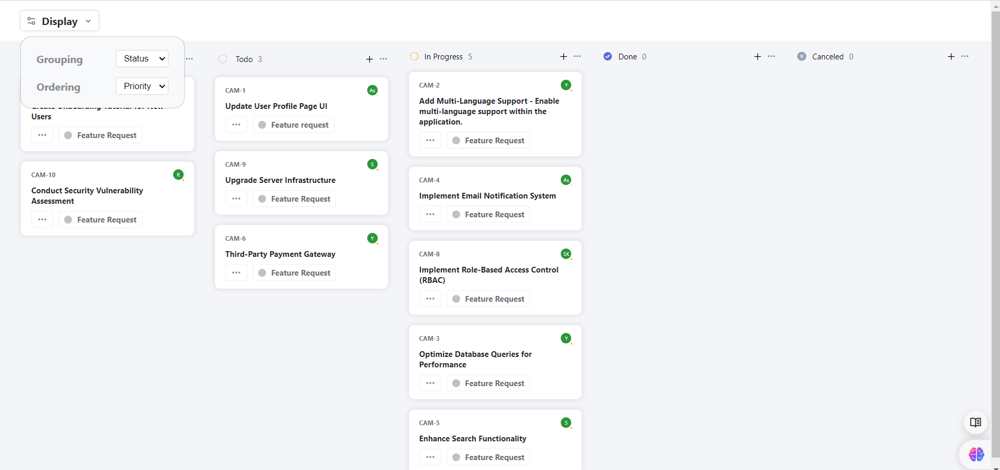
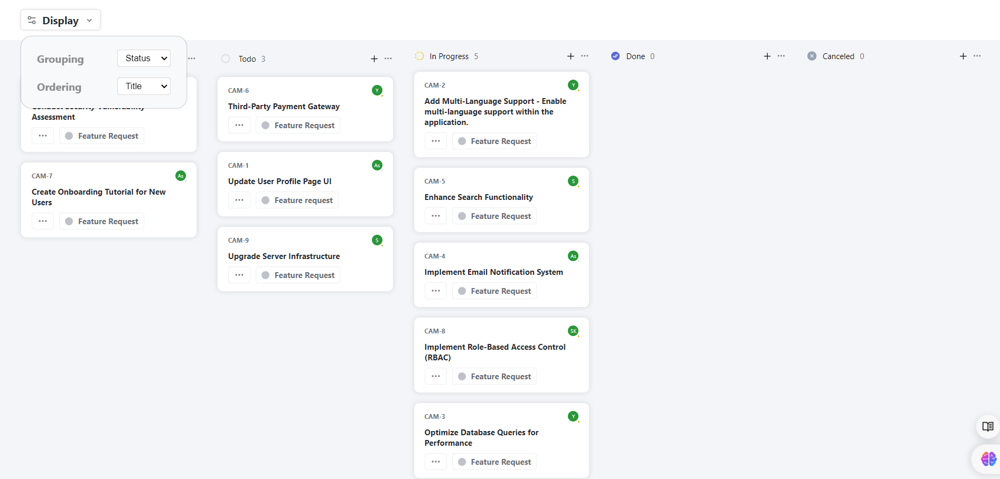
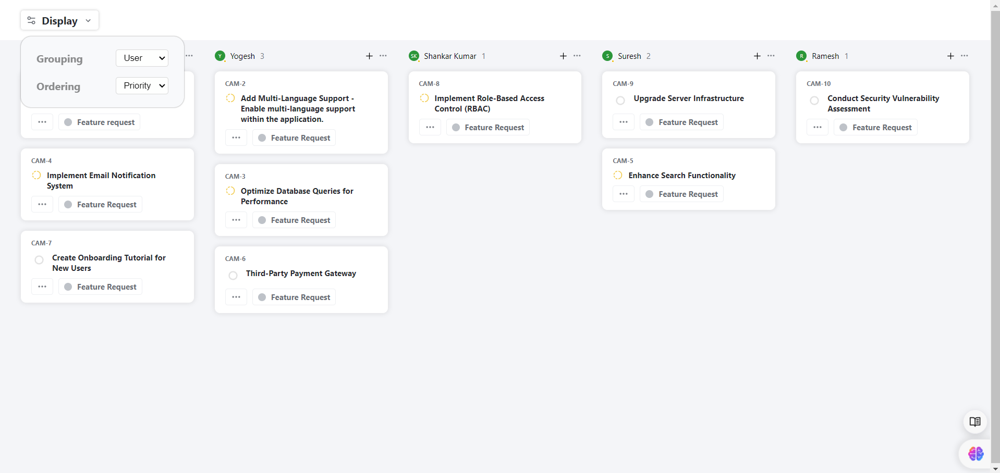
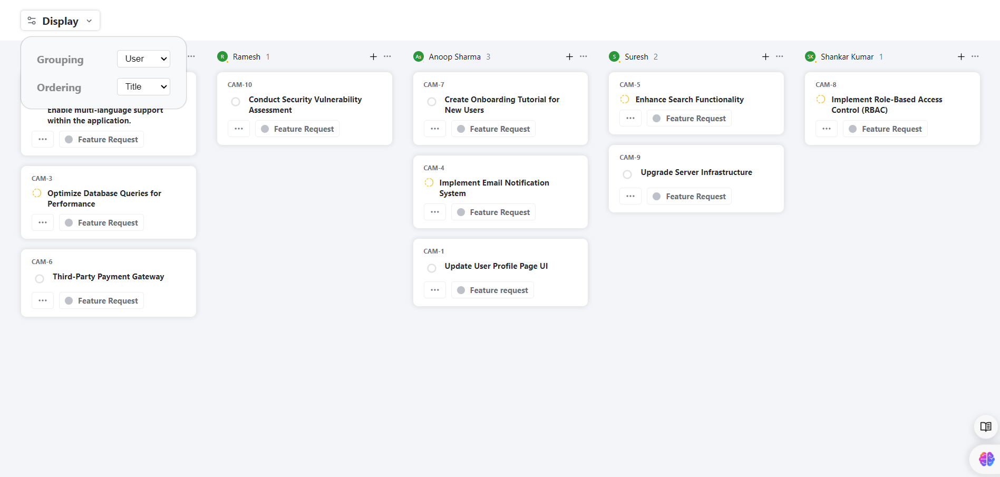
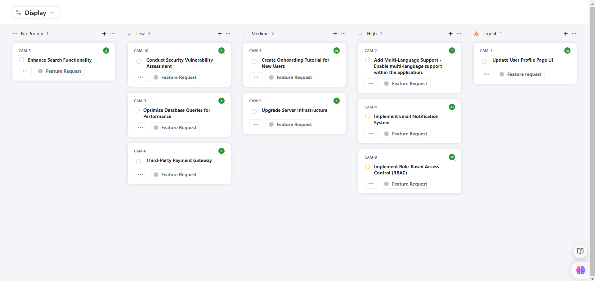
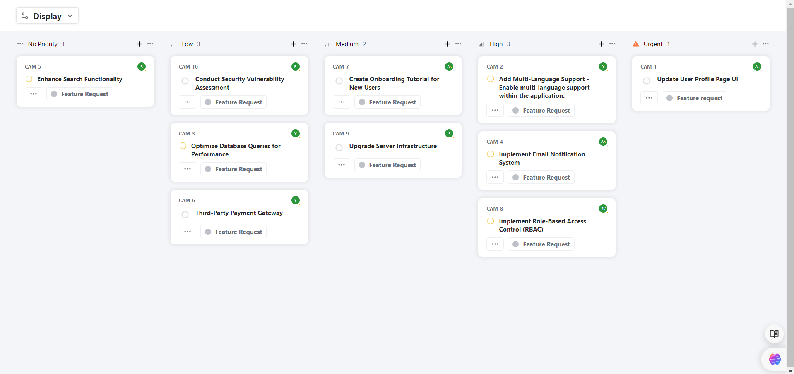

# QuickSell Frontend Assignment

This project is a frontend application built using [Create React App](https://github.com/facebook/create-react-app) and is designed to showcase various features related to the QuickSell platform.

## Table of Contents

- [Getting Started](#getting-started)
- [Available Scripts](#available-scripts)
- [Preview](#preview)
- [Learn More](#learn-more)
- [Contributing](#contributing)
- [License](#license)

## Getting Started

To get started with this project, you'll need to have [Node.js](https://nodejs.org/) and [Yarn](https://yarnpkg.com/) installed on your machine.

### 1. Clone the Repository
```bash
git clone  https://github.com/AjayKumaravelu/QuickSell.git
cd QuickSell
2. Install Dependencies
Run the following command to install the required dependencies:

 
yarn install
3. Run the Application
To start the application in development mode, run:

bash
Copy code
yarn start
Open http://localhost:3000 in your browser to view it.

Available Scripts
In the project directory, you can run the following commands:

yarn start: Runs the app in development mode. The page will reload if you make edits, and you will see any lint errors in the console.

yarn test: Launches the test runner in interactive watch mode. For more information, refer to the Create React App Testing Documentation.

yarn build: Builds the app for production to the build folder. The build is optimized for performance, and your app is ready to be deployed.

yarn eject: Note: This is a one-way operation. If you are not satisfied with the default configurations, you can eject to gain full control. This command will remove the single build dependency from your project and copy all configuration files and dependencies into your project.

Preview
Here are some screenshots of the application:


Learn More
Create React App Documentation
React Documentation
Contributing
Contributions are welcome! Please feel free to submit a pull request or open an issue.


# Getting Started with Create React App

This project was bootstrapped with [Create React App](https://github.com/facebook/create-react-app).

## Available Scripts

In the project directory, you can run:

### `yarn start`

Runs the app in the development mode.\
Open [http://localhost:3000](http://localhost:3000) to view it in the browser.

The page will reload if you make edits.\
You will also see any lint errors in the console.

### `yarn test`

Launches the test runner in the interactive watch mode.\
See the section about [running tests](https://facebook.github.io/create-react-app/docs/running-tests) for more information.

### `yarn build`

Builds the app for production to the `build` folder.\
It correctly bundles React in production mode and optimizes the build for the best performance.

The build is minified and the filenames include the hashes.\
Your app is ready to be deployed!

See the section about [deployment](https://facebook.github.io/create-react-app/docs/deployment) for more information.

### `yarn eject`

**Note: this is a one-way operation. Once you `eject`, you can’t go back!**

If you aren’t satisfied with the build tool and configuration choices, you can `eject` at any time. This command will remove the single build dependency from your project.

Instead, it will copy all the configuration files and the transitive dependencies (webpack, Babel, ESLint, etc) right into your project so you have full control over them. All of the commands except `eject` will still work, but they will point to the copied scripts so you can tweak them. At this point you’re on your own.

You don’t have to ever use `eject`. The curated feature set is suitable for small and middle deployments, and you shouldn’t feel obligated to use this feature. However we understand that this tool wouldn’t be useful if you couldn’t customize it when you are ready for it.

## Learn More

You can learn more in the [Create React App documentation](https://facebook.github.io/create-react-app/docs/getting-started).

To learn React, check out the [React documentation](https://reactjs.org/).

## Preview









